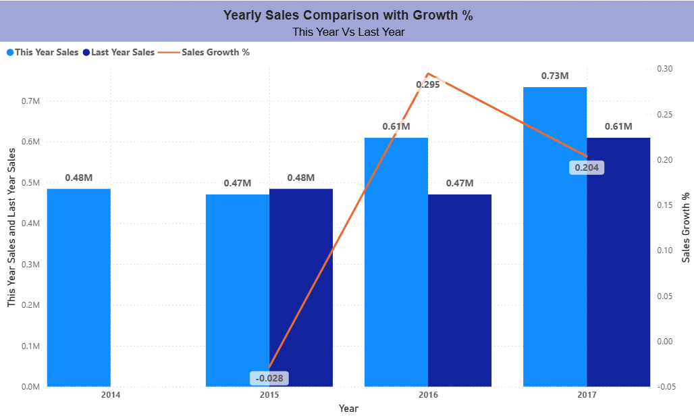
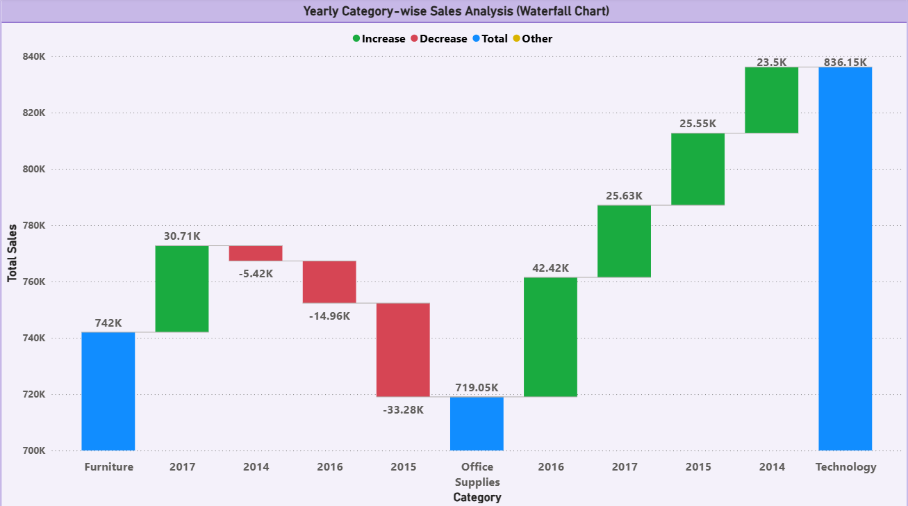
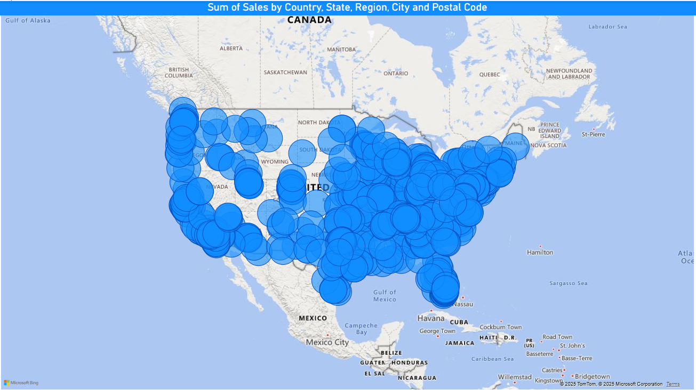
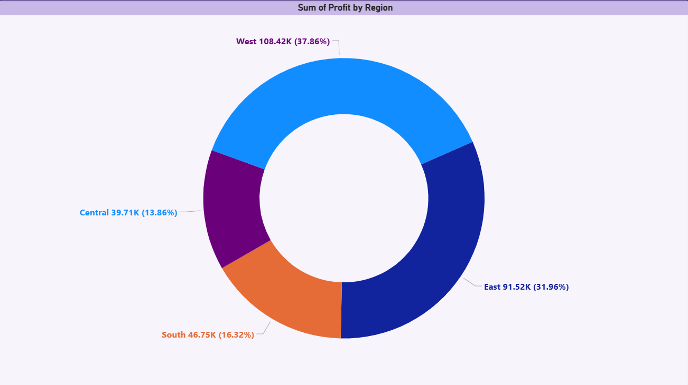
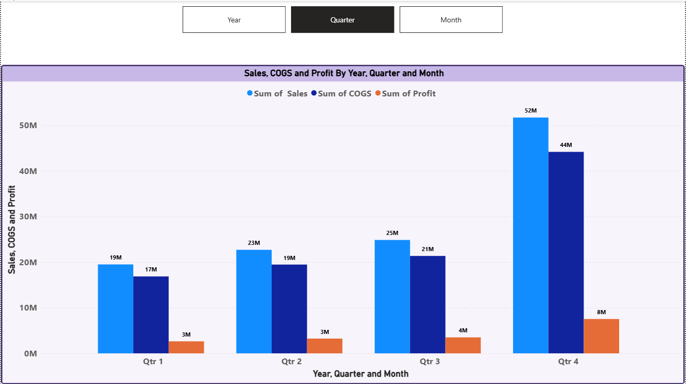
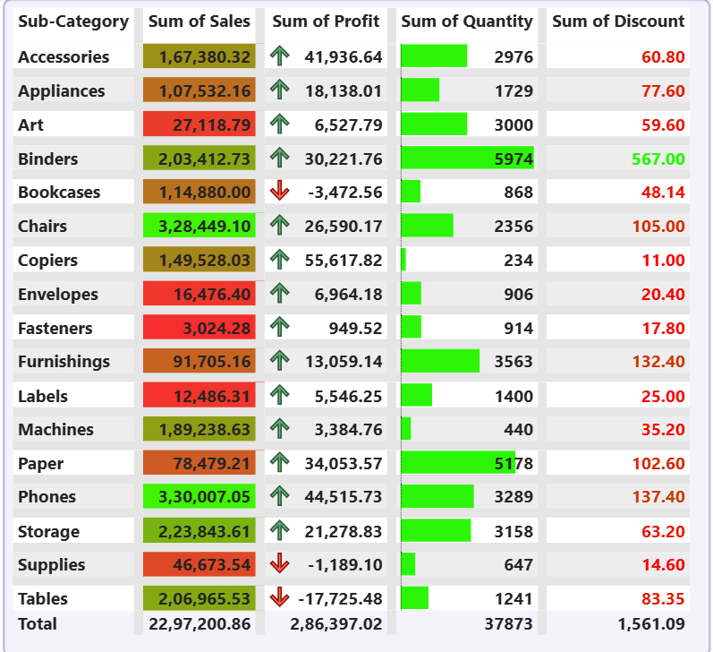

# Task 2 – Data Visualization & Storytelling

## Internship: Data Analyst Internship Task 2

## Objective:
To create a finance performance dashboard using Power BI, conveying insights through effective visual storytelling.

## Dataset:
- Finance dataset (CSV)

## Tools Used:
- Power BI Desktop

## 📊 Visuals Screenshot

## Visuals Created:
- KPI Cards: Total Sales, Total Discount, Total Profit, Profit Margin %
- Donut Chart: Sales by Country
- Line Chart: Sales & Profit by Month
- Bar Chart: Profit by Product
- Tree Map: Profit by Country
- Slicers: Year & Country

## Insights:
- The USA had the highest sales and profit contribution.
- Profit margin overall was 14.10%.
- Paseo product had the highest profit.
- Visual storytelling helps in identifying top-performing countries and products quickly.

## Files:
- `Task 2.pbix`: Power BI file
- `Dashboard SS.png`: Dashboard image
- `TASK 2 DATA ANALYST .pdf`: Task PDF
- `Finance.csv`: Dataset used

## Submission:
Task submitted as per guidelines.
